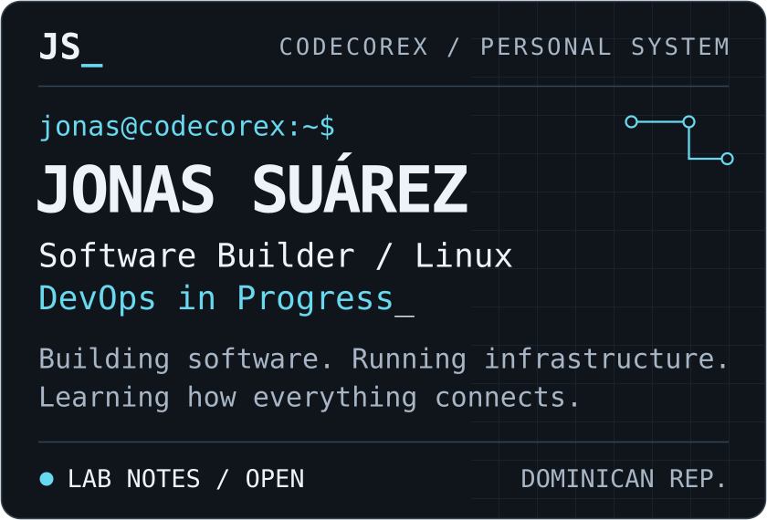
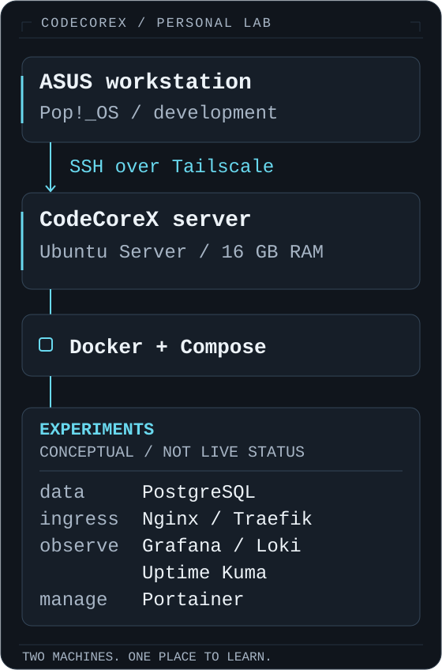

# Jonas Suárez

**Software Builder · Linux · DevOps in Progress**

Dominican Republic 🇩🇴 · [GitHub](https://github.com/Najo24-code) · [Email](mailto:jonassuarez30@gmail.com)

## `jonas@codecorex:~$ whoami`

I'm Jonas — a software builder increasingly interested in what happens after the code works.

I build applications, run a personal Linux lab, and explore how code, containers, networks, and databases fit together. I'm moving deeper into DevOps by operating things, understanding their failures, and automating the repeatable parts.

**Current focus**

| | Area | What I'm working toward |
| :-- | :-- | :-- |
| `01` | Linux administration | Understand the machine behind the service |
| `02` | Docker & containers | Make environments reproducible |
| `03` | Networking | Trace how services reach each other |
| `04` | CI/CD | Check changes before deploying them |
| `05` | Backend engineering | Build APIs with deliberate data models |
| `06` | Cloud fundamentals | Connect local practice to cloud concepts |

## `jonas@codecorex:~$ lab --status`

**CodeCoreX / personal infrastructure lab**

My ASUS workstation runs **Pop!_OS**. My **Ubuntu Server** machine has **16 GB RAM**, with **Docker**, **SSH**, and **Tailscale** as the foundation for learning and operating services.

<p align="center">
  
</p>

The lab is where I experiment with PostgreSQL, Nginx and Traefik, Grafana and Loki, Uptime Kuma, and Portainer — alongside networking, deployments, monitoring, automation, and self-hosted services. These are areas of practice, not a claim that every service is running at once.

## `jonas@codecorex:~$ ls ./building`

### `01 /` SUAPRÉSTAMOS

**Loan management · In development**

A product-oriented application for managing loans and collections. Working across API design, relational data, and a Vue interface brings the backend and the user experience into the same problem.

`Python` · `FastAPI` · `PostgreSQL` · `Vue` · `Docker`

*No public source link available.*

---

### `02 /` [ATLAS / AI Engineering System](https://github.com/Najo24-code/ai-engineering-system)

**Engineering automation · Experimental**

A personal multi-agent engineering system exploring agent responsibilities, permission boundaries, and verification. The interesting question: how do you check an agent's work instead of trusting its report?

`JavaScript` · `Node.js` · `LLM workflows` · `Multi-agent systems`

---

### `03 /` CODECOREX LAB

**Personal infrastructure · Ongoing practice**

The environment behind the experiments: Linux administration, containers, networking, and observability. Repeated operations are opportunities to understand the system and build better tools.

One public piece: [**Atlas CLI**](https://github.com/Najo24-code/atlas-cli), a Go command-line project bringing server, GitHub, and observability operations into one interface.

`Linux` · `Docker Compose` · `SSH` · `Tailscale` · `Go`

## `jonas@codecorex:~$ cat toolbox.conf`

Tools I use in projects or practice with in the lab. Inclusion describes use, not mastery.

| Domain | Tools |
| :-- | :-- |
| `systems` | Linux · Ubuntu Server · Pop!_OS · Bash · SSH · Git |
| `containers` | Docker · Docker Compose |
| `backend & automation` | Python · FastAPI · Go · Node.js |
| `data` | PostgreSQL |
| `web` | JavaScript · TypeScript · Vue · Next.js |
| `lab / ingress` | Nginx · Traefik · Tailscale |
| `lab / observability` | Grafana · Loki · Uptime Kuma |
| `lab / management` | Portainer |

## `jonas@codecorex:~$ ./learning-path`

**A direction of travel, not a completion chart.**

```text
01  Linux administration
    │  services · permissions · logs
    ↓
02  Networking
    │  DNS · routing · HTTP / TLS
    ↓
03  CI/CD
    │  checks · delivery · rollback
    ↓
04  Cloud fundamentals
    │  compute · storage · identity
    ↓
05  Infrastructure as Code
    │  Terraform / planned
    ↓
06  Kubernetes
       orchestration / later
```

I'm deepening Linux, networking, CI/CD, and backend fundamentals. Cloud concepts are a learning focus; Terraform and Kubernetes are later steps, not current expertise.

## `jonas@codecorex:~$ cat philosophy.txt`

**Build → Deploy → Observe → Break → Debug → Automate → Repeat.**

Break things deliberately in the lab. Carry the lessons into the next build.

> I don't just want to know the commands. I want to understand the system.

## `jonas@codecorex:~$ systemctl status curiosity`

```text
● curiosity.service
  Never Stop Learning
  Loaded: loaded
  Active: active (running)

  Linux knowledge      growing
  Infrastructure       evolving
  Things left to learn ∞
  Curiosity            online

jonas@codecorex:~$ █
```

<sub>Personal operating philosophy. No live telemetry attached.</sub>
